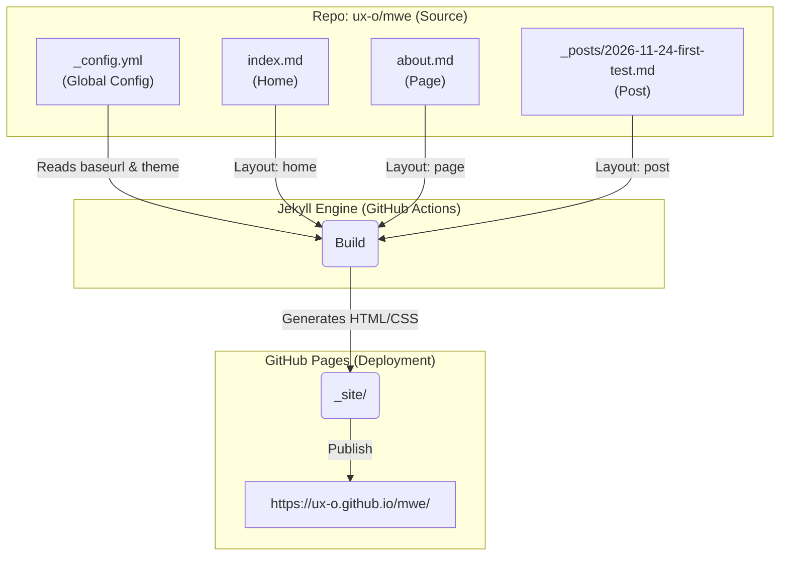

# 图 1：全局架构与构建流（主干图）

这张图展示了你仓库里的静态文件，是如何经过 GitHub Actions 里的 Jekyll 引擎，最终变成网站 HTML 的。

```mermaid
graph TD
    subgraph "Repo: ux-o/mwe (Source)"
        C["_config.yml<br/>(Global Config)"]
        I["index.md<br/>(Home)"]
        A["about.md<br/>(Page)"]
        P["_posts/2026-11-24-first-test.md<br/>(Post)"]
    end

    subgraph "Jekyll Engine (GitHub Actions)"
        C -->|Reads baseurl & theme| J(Build)
        I -->|Layout: home| J
        A -->|Layout: page| J
        P -->|Layout: post| J
    end

    subgraph "GitHub Pages (Deployment)"
        J -->|Generates HTML/CSS| S(_site/)
        S -->|Publish| U["https://ux-o.github.io/mwe/"]
    end
```    