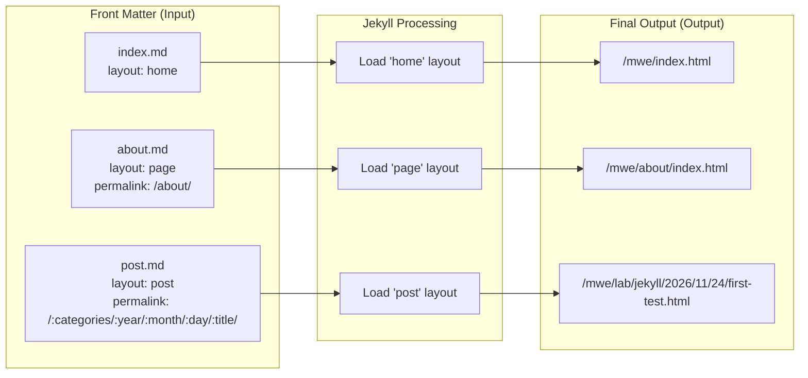

# 图 2：路由与布局流程图（基于 Front Matter）

这张图专门解释 Front Matter 的作用。不同的 layout 和 permalink 是如何决定最终页面长什么样、URL 是什么的。



```mermaid
flowchart LR
    subgraph "Front Matter (Input)"
        F1["index.md<br/>layout: home"]
        F2["about.md<br/>layout: page<br/>permalink: /about/"]
        F3["post.md<br/>layout: post<br/>permalink: /:categories/:year/:month/:day/:title/"]
    end

    subgraph "Jekyll Processing"
        L1[Load 'home' layout]
        L2[Load 'page' layout]
        L3[Load 'post' layout]
    end

    subgraph "Final Output (Output)"
        O1["/mwe/index.html"]
        O2["/mwe/about/index.html"]
        O3["/mwe/lab/jekyll/2026/11/24/first-test.html"]
    end

    F1 --> L1 --> O1
    F2 --> L2 --> O2
    F3 --> L3 --> O3
```

