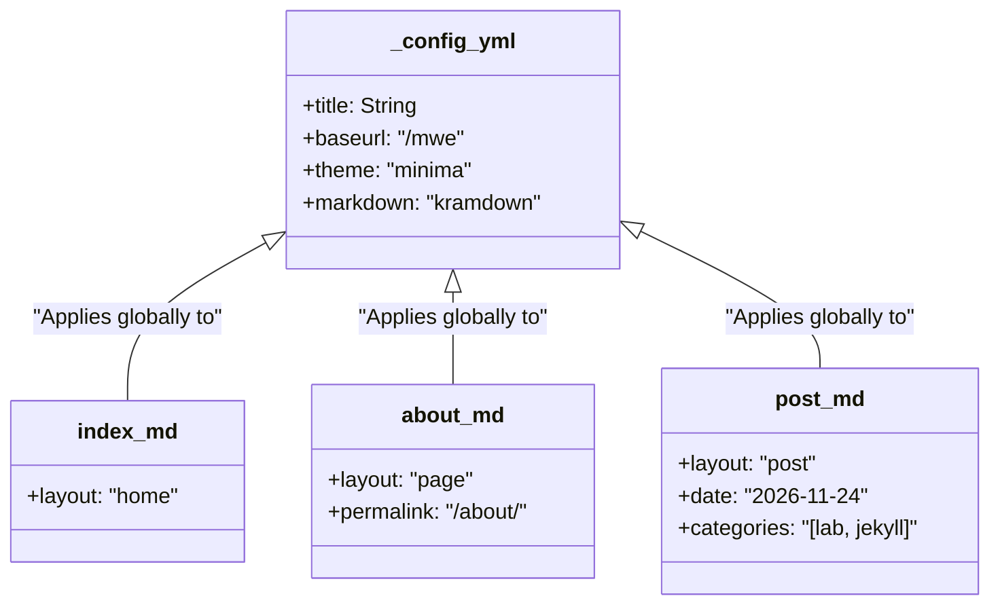

# 图 3：数据与依赖关系图（实体关系）

这张图展示 _config.yml 是如何作为“大脑”，全局影响其他文件的（比如 baseurl 影响了所有页面的链接生成，theme: minima 决定了所有 layout 的底色）。



```mermaid
classDiagram
    class _config_yml {
        +title: String
        +baseurl: "/mwe"
        +theme: "minima"
        +markdown: "kramdown"
    }

    class index_md {
        +layout: "home"
    }

    class about_md {
        +layout: "page"
        +permalink: "/about/"
    }

    class post_md {
        +layout: "post"
        +date: "2026-11-24"
        +categories: "[lab, jekyll]"
    }

    _config_yml <|-- index_md : "Applies globally to"
    _config_yml <|-- about_md : "Applies globally to"
    _config_yml <|-- post_md : "Applies globally to"
```

